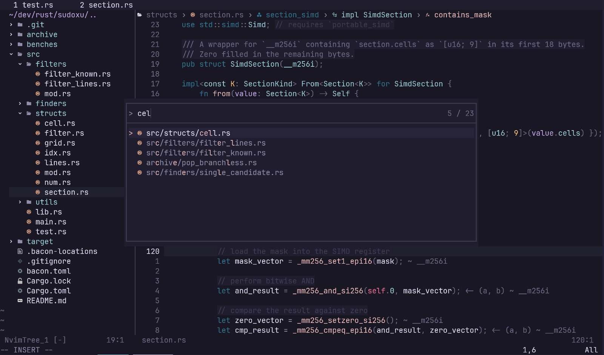

# ~/.config/nvim

My neovim config.
- Functional yet slim.
- Managed by `lazy.nvim`.
- Configured for `{.rs, .py, .lua, .go, .zig, .c, .cpp}`.
- Featuring _Rosé Pine_ <3.

## 🧩 Main Plugins
### Code
- Autocompletion: `hrsh7th/nvim-cmp`, `L3MONA4D3/LuaSnip`, `rafamadriz/friendly-snippets`.
- QoL: `kylechui/nvim-surround`, `vim-scripts/ReplaceWithRegister`, `windwp/nvim-autopairs`, `echasnovski/mini.nvim`, `nvim-treesitter/nvim-treesitter-textobjects`.
- Git: `lewis6991/gitsigns.nvim`.
- LSP: `neovim/nvim-lspconfig`, `williamboman/mason`, `nvimdev/lspsaga.nvim`. 
- Extra Lang Support: `ray-x/go.nvim`, `Canop/nvim-bacon`, `mrcjkb/rustaceanvim`.
- Debugging: `mfussenegger/nvim-dap`.
### Editor
- Explorer: `nvim-tree/nvim-tree.lua`, `stevearc/oil.nvim`, `nvim-telescope/telescope.nvim`, `thePrimagen/harpoon`.
- Movement: `ggandor/leap.nvim`, `ggandor/flit.nvim`.
